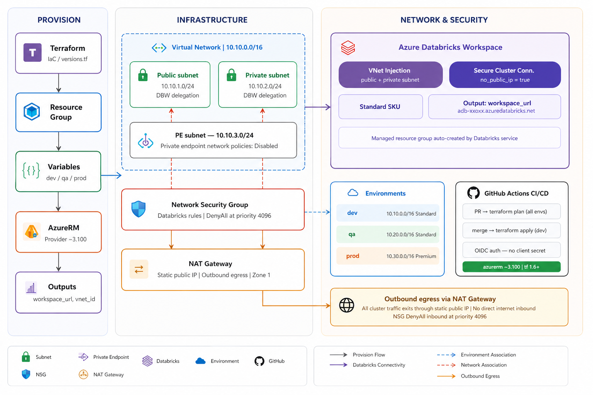

# azure-databricks-platform

Terraform IaC for Azure Databricks with VNet injection across dev / qa / prod environments.
Built as a Terraform equivalent of production Bicep patterns.

## Architecture



## What this provisions

- **Resource Group** per environment
- **Virtual Network** with three subnets:
  - Public subnet (Databricks delegation)
  - Private subnet (Databricks delegation)
  - Private endpoint subnet
- **NSG** with all Databricks-required inbound and outbound rules
- **NAT Gateway** for controlled outbound egress with a static public IP
- **Azure Databricks workspace** with VNet injection and Secure Cluster Connectivity (no public IP on nodes)

## Prerequisites

- Terraform >= 1.6.0
- Azure CLI (`az login`)
- Contributor access on target subscription

## Usage

```bash
terraform init
terraform plan
terraform apply
```

## Environments

| Environment | VNet CIDR     | SKU      |
|-------------|---------------|----------|
| dev         | 10.10.0.0/16  | Standard |
| qa          | 10.20.0.0/16  | Standard |
| prod        | 10.30.0.0/16  | Premium  |

